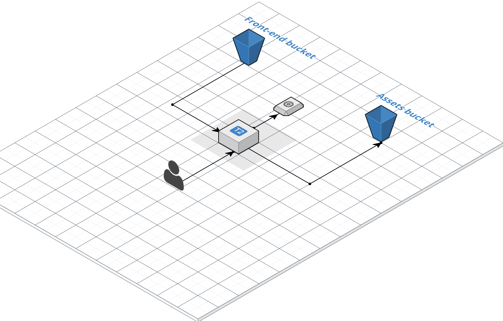

# Secure Stack Terraform ![version][version-badge]

[version-badge]: https://img.shields.io/badge/version-0.0.1-blue.svg

This Terraform script allows you to provision a back-end and front-end app with Nginx and Let’s Encrypt.

-------

## Requirements

1. Download & Install [Terraform]
2. Download & Install [AWS CLI]
3. [Configure the AWS CLI] with the AWS Secret Access Key ID, AWS Secret Access Key and default region of the AWS account where the environments will be provisioned
4. Register a domain and create a Route 53 hosted zone

[Terraform]:https://www.terraform.io/
[AWS CLI]:http://docs.aws.amazon.com/cli/latest/userguide/installing.html
[Configure the AWS CLI]:http://docs.aws.amazon.com/cli/latest/userguide/cli-chap-getting-started.html

## Installation Steps

You need to set-up the following variables:

- *aws_key_name* the name for the key pair
- *aws_public_key_path* the absolute path where the public key is placed your pc
- *aws_private_key_path* the absolute path where the private key is placed on your pc
- *be_subdomain* the back-end domain name
- *fe_subdomain* the front-end domain name
- *certificate_email* The email used by the certbot for the SSL certificate issuing process
- *route53_zone_name* Name of the domain registered and managed through route53
- *my_ip_address* CIDR address from where the SSH connection to the instance is allowed
- *s3_frontend_bucket_name* S3 bucket name where the frontend files are placed
- *s3_assets_bucket_name* S3 bucket name where back-end stores the asset files

## Referenced architecture

